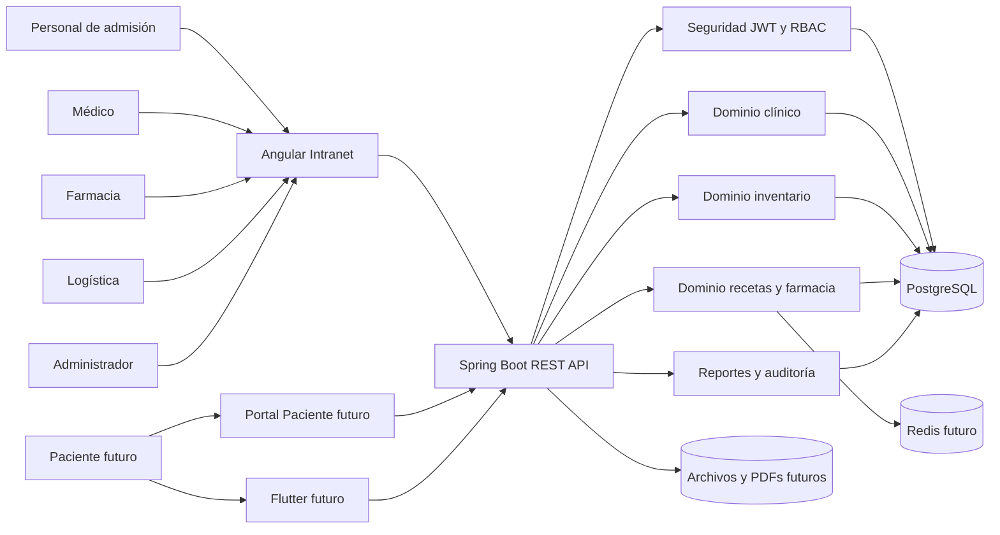
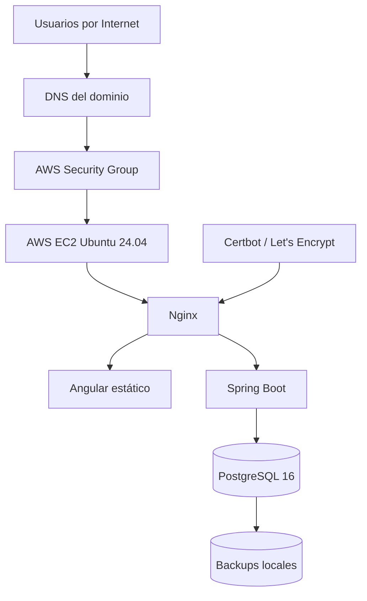
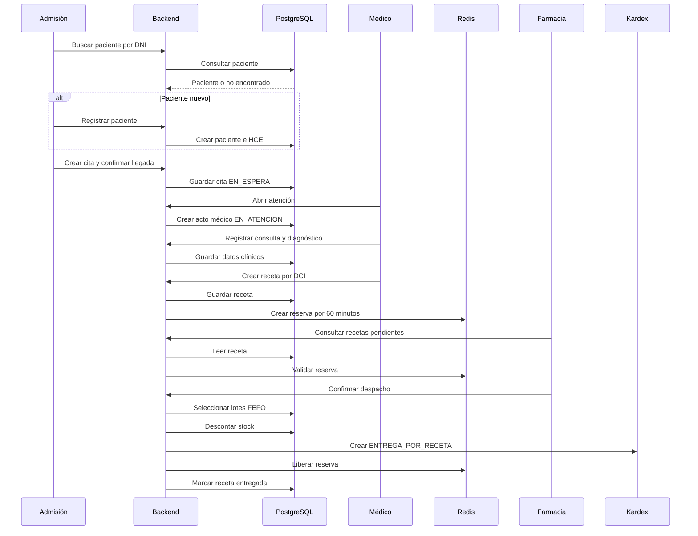
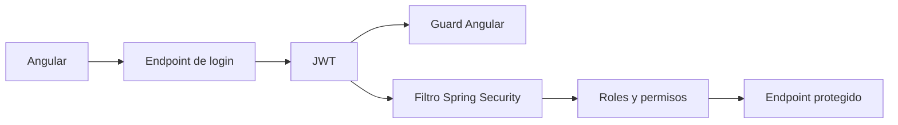
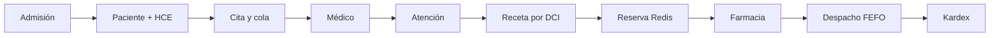

# ARQUITECTURA

## ERP Clínica Principal — Centro Médico San Fernando Huaraz

> Documento vivo de arquitectura del software.  
> Debe actualizarse al cerrar cada bloque o conjunto funcional probado, versionado, desplegado y validado en AWS.

**Versión documental:** 1.1
**Última actualización:** 2026-07-23  
**Responsable del proyecto:** Ing. Albert Huerta  
**Estado:** Arquitectura base productiva activa; evolución hacia el MVP 2 clínico.

---

# 1. Objetivo de la arquitectura

La arquitectura debe soportar un ERP clínico modular, seguro, trazable y desplegable de forma incremental.

El sistema debe permitir:

- Operar inicialmente para el Centro Médico San Fernando.
- Reutilizar la solución posteriormente en otras clínicas.
- Mantener configuración institucional independiente.
- Desplegar nuevos módulos sin alterar los ya validados.
- Conservar integridad clínica, farmacéutica y contable.
- Garantizar trazabilidad de operaciones sensibles.
- Mantener una única fuente de verdad para los datos persistentes.
- Separar responsabilidades entre presentación, negocio, persistencia e infraestructura.

---

# 2. Principios arquitectónicos aprobados

1. **Arquitectura modular por dominio.**
2. **Backend único Spring Boot** durante la etapa actual.
3. **Frontend Angular unificado** para el personal de la clínica.
4. **Flutter futuro** como cliente móvil del paciente.
5. **PostgreSQL como fuente definitiva de datos.**
6. **Redis únicamente para información temporal**, como reservas con expiración.
7. **API REST versionable y protegida.**
8. **Migraciones Flyway aditivas**, sin modificar migraciones productivas anteriores.
9. **Despliegues incrementales y reversibles.**
10. **Kardex y HCE con reglas de inmutabilidad y auditoría.**
11. **Seguridad antes de exponer información clínica.**
12. **No considerar cerrado un bloque si solo funciona localmente.**

---

# 3. Vista general del sistema



---

# 4. Arquitectura por capas

## 4.1 Capa de presentación

### Angular Intranet

Aplicación principal para el personal.

Responsabilidades:

- Login y sesión.
- Navegación por rol.
- Formularios.
- Validaciones de interfaz.
- Consumo de API.
- Visualización de dashboards.
- Gestión de flujos operativos.
- Manejo de respuestas 401 y 403.
- No debe contener reglas críticas exclusivas.

### Portal web del paciente

Previsto para una etapa posterior.

Responsabilidades futuras:

- Perfil.
- Citas.
- Recetas.
- Resultados.
- Pagos y comprobantes.
- Notificaciones.

### Flutter

Previsto como extensión móvil.

Regla:

- Debe consumir la misma API.
- No debe duplicar la lógica de negocio del backend.

## 4.2 Capa de aplicación y negocio

Implementada con Spring Boot.

Responsabilidades:

- Autenticación.
- Autorización.
- Casos de uso.
- Reglas clínicas.
- Reglas de inventario.
- FEFO.
- Reservas.
- Transacciones.
- Auditoría.
- Integración entre módulos.
- Exposición de endpoints REST.

## 4.3 Capa de persistencia

Implementada con:

- Spring Data JPA.
- Hibernate.
- Flyway.
- PostgreSQL.

Responsabilidades:

- Persistencia transaccional.
- Integridad referencial.
- Restricciones.
- Índices.
- Historial.
- Bloqueos cuando sean necesarios.
- Migraciones controladas.

## 4.4 Capa temporal

Redis se incorporará para:

- Reservas de stock con expiración.
- Prevención de doble compromiso.
- Datos efímeros.
- Posible caché controlada.

Redis no reemplaza a PostgreSQL como fuente definitiva.

## 4.5 Capa de infraestructura

- AWS EC2.
- Ubuntu Server 24.04 LTS.
- Docker.
- Docker Compose.
- Nginx.
- Certbot.
- UFW.
- Fail2ban.
- GitHub.
- DNS público.
- Backups PostgreSQL.

---

# 5. Arquitectura física actual en AWS



## 5.1 Instancia

- Proveedor: AWS.
- Servicio: EC2.
- Región: `us-east-1`.
- Sistema operativo: Ubuntu Server 24.04 LTS.
- Elastic IP: `3.213.172.216`.
- Hostname: `vps-sanfernando-erp-prod`.
- Usuario operativo: `deploy`.

## 5.2 Security Group

Reglas vigentes:

```text
SSH 22    → 190.233.77.0/24
HTTP 80   → 0.0.0.0/0
HTTPS 443 → 0.0.0.0/0
```

El puerto de PostgreSQL no se publica.

## 5.3 Firewall del sistema

UFW:

```text
Default incoming: deny
Default outgoing: allow
OpenSSH: permitido
Nginx Full: permitido
```

## 5.4 Contenedores activos

```text
sanfernando-backend
sanfernando-postgres
```

Estado validado:

- Backend `Up`.
- PostgreSQL `Up (healthy)`.
- Backend enlazado a `127.0.0.1:8085`.
- PostgreSQL accesible solo desde la red Docker.

## 5.5 Redis futuro

Se añadirá como un tercer servicio:

```text
sanfernando-redis
```

Debe quedar:

- Sin publicación pública.
- Accesible únicamente desde la red interna de Docker.
- Con política de persistencia acorde al uso temporal.
- Con health check.

---

# 6. Dominios y enrutamiento

## 6.1 Dominios activos

```text
https://sanfernandocentromedico.com
https://www.sanfernandocentromedico.com
https://api.sanfernandocentromedico.com
https://intranet.sanfernandocentromedico.com
https://paciente.sanfernandocentromedico.com
```

## 6.2 Responsabilidad por dominio

| Dominio | Responsabilidad |
|---|---|
| `sanfernandocentromedico.com` | Landing institucional |
| `www.sanfernandocentromedico.com` | Redirección al dominio principal |
| `api.sanfernandocentromedico.com` | API Spring Boot |
| `intranet.sanfernandocentromedico.com` | Angular del personal |
| `paciente.sanfernandocentromedico.com` | Portal futuro del paciente |

## 6.3 Nginx

Responsabilidades:

- Terminación TLS.
- Redirección HTTP a HTTPS.
- Reverse proxy hacia Spring Boot.
- Publicación de Angular.
- Soporte de rutas SPA.
- Encabezados de proxy.
- Separación por subdominios.

---

# 7. Rutas productivas

```text
/opt/sanfernando/backend/repo
/opt/sanfernando/backend/repo/deploy/ec2-vps
/opt/sanfernando/backups/postgres
/var/www/sanfernando/landing
/var/www/sanfernando/intranet
/var/www/sanfernando/paciente
```

## 7.1 Backend

Repositorio:

```text
/opt/sanfernando/backend/repo
```

Docker Compose:

```text
/opt/sanfernando/backend/repo/deploy/ec2-vps/docker-compose.yml
```

Variables:

```text
/opt/sanfernando/backend/repo/deploy/ec2-vps/.env
```

## 7.2 Frontend

Aplicación Angular productiva:

```text
/var/www/sanfernando/intranet
```

---

# 8. Módulos de dominio

## 8.1 Seguridad

Estado actual:

- Seguridad de infraestructura activa.
- Seguridad de aplicación aún pendiente.

Objetivo:

- Usuarios.
- Roles.
- Permisos.
- BCrypt.
- JWT.
- Cierre de sesión.
- Guards Angular.
- Protección por endpoint.
- Auditoría de accesos.
- Bloqueo por intentos fallidos futuro.

## 8.2 Inventario y logística

Estado: desplegado y funcional.

Componentes:

- DCI.
- Medicamentos comerciales.
- Categorías.
- Laboratorios.
- Proveedores.
- Unidades.
- Presentaciones.
- Factor de conversión.
- Lotes.
- Stock.
- Ingresos.
- Salidas.
- FEFO.
- Kardex.
- Dashboard.

## 8.3 Pacientes y admisión

Estado: pendiente.

Componentes previstos:

- Paciente único.
- Documento de identidad.
- Prevención de duplicados.
- Historia clínica única.
- Citas.
- Recepción.
- Cola.
- Estados de cita.

## 8.4 Atención médica

Estado: pendiente.

Componentes previstos:

- Acto médico.
- Motivo.
- Anamnesis.
- Examen físico.
- Diagnóstico.
- Indicaciones.
- Cierre.
- Trazabilidad.
- Fichas futuras por especialidad.

## 8.5 Recetas

Estado: pendiente.

Componentes previstos:

- Prescripción por DCI.
- Dosis.
- Frecuencia.
- Duración.
- Vía.
- Cantidad.
- Indicaciones.
- Estado.
- Vínculo con atención.
- Identificador único.

## 8.6 Farmacia

Estado: pendiente.

Componentes previstos:

- Bandeja de recetas.
- Validación.
- Reserva.
- Despacho.
- FEFO.
- Despacho parcial.
- Cierre.
- Kardex `ENTREGA_POR_RECETA`.

## 8.7 Caja y pagos

Estado: postergado.

Se desarrollará después del MVP 2.

## 8.8 Laboratorio

Estado: postergado.

## 8.9 Reportes y auditoría

Estado: parcial.

Actualmente existe trazabilidad de Kardex.  
La auditoría transversal se implementará posteriormente.

---

# 9. Flujo funcional objetivo del MVP 2



---

# 10. Modelo de datos actual y evolución

## 10.1 Migraciones aplicadas

```text
V1__crear_tabla_sistema_info.sql
V2__crear_modelo_inventario_farmaceutico.sql
V3__agregar_factor_presentacion_medicamento.sql
V4__agregar_tipo_entrega_por_receta_kardex.sql
```

## 10.2 Regla de evolución

Toda nueva estructura debe añadirse desde:

```text
V5
```

No se permite:

- Modificar V1 a V4.
- Renombrarlas.
- Eliminar migraciones aplicadas.
- Cambiar checksums.
- Reinicializar el volumen productivo.

## 10.3 Dominios de datos futuros

### Seguridad

- usuarios
- roles
- permisos
- usuario_roles
- sesiones o refresh_tokens
- auditoria_accesos

### Configuración clínica

- especialidades
- médicos
- servicios
- consultorios
- horarios

### Pacientes

- pacientes
- historias_clinicas
- contactos_emergencia
- consentimientos
- cambios_paciente

### Citas

- citas
- estados_cita
- triajes

### Atención médica

- actos_medicos
- diagnósticos
- atencion_diagnosticos
- indicaciones
- antecedentes

### Recetas

- recetas
- receta_detalles
- estados_receta

### Reserva

Persistencia definitiva:

- reservas_stock
- reserva_detalles
- eventos_reserva

Temporal:

- claves Redis con TTL.

### Farmacia

- despachos
- despacho_detalles
- referencias a Kardex.

---

# 11. Reglas de integridad

## 11.1 Paciente

- Documento único según tipo.
- Una HCE por paciente.
- No eliminación física de historia clínica.

## 11.2 Atención

- Una atención pertenece a una cita y paciente.
- Una atención cerrada no se elimina.
- Correcciones auditadas.

## 11.3 Receta

- Pertenece a una atención.
- Debe identificar médico y paciente.
- No puede despacharse dos veces.
- El detalle debe conservar el DCI prescrito.

## 11.4 Inventario

- Stock no negativo.
- Descuento transaccional.
- FEFO por fecha de vencimiento.
- El despacho confirmado actualiza PostgreSQL.
- Redis no modifica el stock definitivo.

## 11.5 Kardex

- Inmutable.
- Stock anterior y posterior obligatorios.
- Referencia funcional obligatoria.
- Usuario y fecha obligatorios.

---

# 12. Seguridad de aplicación objetivo



## 12.1 Roles mínimos del MVP 2

```text
ADMIN
ADMISION
MEDICO
FARMACIA
LOGISTICA
```

## 12.2 Reglas

- Contraseñas con BCrypt.
- No guardar contraseñas en texto plano.
- JWT firmado.
- Expiración definida.
- Endpoints públicos mínimos.
- Menú Angular según rol.
- Backend como autoridad final.
- Respuestas 401 y 403 consistentes.
- Datos clínicos protegidos.
- Secretos fuera del repositorio.

---

# 13. API y convenciones

Base productiva:

```text
https://api.sanfernandocentromedico.com/api
```

Convenciones previstas:

```text
/api/public/**
/api/auth/**
/api/admin/**
/api/admission/**
/api/medical/**
/api/pharmacy/**
/api/inventory/**
```

Reglas:

- JSON.
- Fechas ISO 8601.
- Errores estructurados.
- Validación backend.
- Códigos HTTP correctos.
- No exponer entidades JPA directamente cuando la evolución requiera DTO.
- Paginación en listados grandes.
- Filtros explícitos.
- Auditoría en operaciones sensibles.

---

# 14. Transacciones críticas

Deben ser transaccionales:

- Registro de paciente e HCE.
- Apertura de atención.
- Cierre de atención.
- Creación de receta.
- Confirmación de reserva definitiva.
- Despacho de farmacia.
- Descuento por múltiples lotes FEFO.
- Creación de movimientos Kardex.
- Liberación de reserva.
- Anulación controlada.

En despacho:

```text
Validar receta
→ validar reserva
→ bloquear o validar lotes
→ calcular FEFO
→ descontar stock
→ registrar despacho
→ crear Kardex
→ cerrar receta
→ liberar reserva
```

Si un paso crítico falla, la operación debe revertirse.

---

# 15. Estrategia de reservas con Redis

## 15.1 Principio

PostgreSQL conserva:

- Stock físico.
- Receta.
- Reserva registrada.
- Estado final.
- Auditoría.

Redis conserva:

- Disponibilidad temporal.
- TTL.
- Bloqueo lógico.
- Marcador de expiración.

## 15.2 Clave propuesta

```text
stock-reservation:{reservationId}
```

Contenido conceptual:

```json
{
  "reservationId": 1001,
  "prescriptionId": 501,
  "patientId": 301,
  "expiresAt": "2026-07-23T23:00:00-05:00"
}
```

## 15.3 Reglas

- TTL inicial: 60 minutos.
- Crear una sola reserva activa por receta.
- Liberación idempotente.
- Despacho idempotente.
- Recuperación ante caída de Redis mediante persistencia en PostgreSQL.
- Job de reconciliación futuro.

---

# 16. Estrategia de despliegue

## 16.1 Backend

Flujo actual:

```text
Desarrollo local
→ pruebas
→ build Maven
→ commit
→ push GitHub
→ backup productivo
→ git pull en EC2
→ docker compose build
→ docker compose up -d
→ health check
→ pruebas funcionales
→ actualización documental
```

## 16.2 Angular

Flujo previsto:

```text
Desarrollo local
→ pruebas
→ ng build
→ commit
→ push GitHub
→ backup del dist productivo
→ copiar build
→ validar Nginx
→ prueba HTTPS
→ actualización documental
```

## 16.3 Migraciones

Flyway ejecuta migraciones al iniciar el backend.

Controles:

- Backup previo.
- Revisar SQL.
- No modificar migraciones aplicadas.
- Validar logs de Flyway.
- Probar endpoints.
- Rollback operativo mediante restauración cuando corresponda.

---

# 17. Backups y recuperación

## 17.1 Estado actual

Script:

```text
deploy/ec2-vps/scripts/02_backup_postgres.sh
```

Ruta:

```text
/opt/sanfernando/backups/postgres
```

Incluye:

- `pg_dump`.
- Compresión gzip.
- Validación `gunzip -t`.
- Retención local de 14 días.
- Ejecución independiente de la ruta actual.

## 17.2 Pendientes

- Cron.
- Copia externa.
- Cifrado.
- Prueba formal de restauración.
- Política de recuperación.
- RPO y RTO.
- Respaldo del frontend y configuración.
- Respaldo de Nginx.
- Respaldo de secretos fuera de Git.

---

# 18. Observabilidad

## 18.1 Actual

- `docker compose ps`.
- Logs Docker.
- Health endpoint.
- Nginx logs.
- UFW.
- Fail2ban.
- Certbot.
- Comandos manuales.

## 18.2 Futuro

- Alertas.
- Métricas.
- Uso de CPU.
- Memoria.
- Disco.
- Estado de contenedores.
- Tiempo de respuesta.
- Errores 5xx.
- Certificado SSL.
- Backups.
- Costos AWS.
- Logs centralizados.

---

# 19. Decisiones arquitectónicas registradas

## ADR-001 — Monolito modular

**Decisión:** mantener un backend Spring Boot único durante la fase actual.

**Razón:** menor complejidad operativa, despliegue más simple y suficiente para el alcance inicial.

## ADR-002 — PostgreSQL como fuente definitiva

**Decisión:** todo dato persistente y clínicamente relevante se almacena en PostgreSQL.

## ADR-003 — Redis para temporalidad

**Decisión:** Redis se usará para reservas con TTL, no como fuente definitiva.

## ADR-004 — Angular unificado

**Decisión:** pacientes internos y personal usarán aplicaciones separadas cuando corresponda, pero la intranet del personal será un Angular unificado por roles.

## ADR-005 — Migraciones aditivas

**Decisión:** ninguna migración aplicada en producción será modificada.

## ADR-006 — Kardex inmutable

**Decisión:** los movimientos no se actualizan ni eliminan.

## ADR-007 — Prescripción por DCI

**Decisión:** el médico prescribe principalmente por denominación común internacional.

## ADR-008 — FEFO

**Decisión:** farmacia y logística consumen primero los lotes con vencimiento más próximo.

## ADR-009 — Pagos postergados

**Decisión:** pagos, caja y facturación se desarrollan después del MVP 2 clínico.

## ADR-010 — Regla de cierre productivo

**Decisión:** un bloque solo se cierra cuando está probado, versionado, desplegado y validado en AWS, con documentación actualizada.

---

# 20. Arquitectura objetivo de la segunda entrega



Criterio arquitectónico:

- Cada módulo tendrá responsabilidades claras.
- La integración será aditiva.
- El inventario actual no será reemplazado.
- El despacho utilizará los servicios de stock y Kardex existentes.
- Se incorporarán nuevas migraciones desde V5.
- Los endpoints existentes de inventario deben mantenerse compatibles.

---

# 21. Riesgos arquitectónicos

## Exposición de información clínica

Mitigación:

- JWT.
- RBAC.
- HTTPS.
- Endpoints protegidos.
- Auditoría.

## Inconsistencia entre Redis y PostgreSQL

Mitigación:

- PostgreSQL como autoridad.
- Reserva persistida.
- Operaciones idempotentes.
- Reconciliación.

## Doble despacho

Mitigación:

- Estado de receta.
- Restricción única.
- Transacción.
- Bloqueo controlado.
- Idempotencia.

## Despliegue con migraciones defectuosas

Mitigación:

- Backup.
- Pruebas locales.
- Revisión SQL.
- Flyway.
- Validación productiva.

## Crecimiento de un monolito desordenado

Mitigación:

- Paquetes por dominio.
- Servicios de aplicación.
- DTO.
- Repositorios separados.
- Dependencias controladas.
- Documentación viva.

---

# 22. Estructura lógica recomendada del backend

```text
src/main/java/.../
├── common
│   ├── config
│   ├── exception
│   ├── audit
│   └── security
├── auth
├── users
├── clinicalcatalog
├── patients
├── admissions
├── appointments
├── triage
├── medicalcare
├── prescriptions
├── pharmacy
├── inventory
├── reporting
└── infrastructure
```

Cada dominio puede contener:

```text
controller
dto
service
repository
entity
mapper
validator
```

La estructura final debe adaptarse al código existente sin realizar una reestructuración riesgosa durante un bloque funcional.

---

# 23. Estructura lógica recomendada de Angular

```text
src/app/
├── core
│   ├── auth
│   ├── guards
│   ├── interceptors
│   ├── services
│   └── models
├── layout
├── shared
├── features
│   ├── dashboard
│   ├── inventory
│   ├── admissions
│   ├── patients
│   ├── medical
│   ├── prescriptions
│   ├── pharmacy
│   └── administration
└── app.routes.ts
```

Reglas:

- Componentes compartidos reutilizables.
- Lazy loading cuando convenga.
- Guards por rol.
- Interceptor JWT.
- Servicios HTTP por dominio.
- Modelos tipados.
- No guardar secretos en Angular.

---

# 24. Evolución futura

Después del MVP 2:

- Caja y pagos.
- Laboratorio.
- Portal paciente.
- Flutter.
- Especialidades.
- Reportes avanzados.
- Facturación.
- Integración SUNAT.
- Notificaciones.
- Firma digital.
- Observabilidad avanzada.
- Backups externos.
- Alta disponibilidad futura.

La arquitectura actual no pretende resolver alta disponibilidad multiinstancia en esta etapa, pero debe evitar decisiones que impidan evolucionar.

---

# 25. Documentos relacionados

```text
docs/HOJA DE RUTA PRINCIPAL.md
docs/ARQUITECTURA.md
```

Ambos documentos deben actualizarse conjuntamente cuando un avance cambie:

- Alcance.
- Reglas.
- Módulos.
- Datos.
- Infraestructura.
- Seguridad.
- Despliegue.
- Hoja de ruta.

---

# 26. Historial del documento

## Versión 1.0

- Creación inicial.
- Registro de la arquitectura productiva en AWS.
- Registro de backend, Angular, PostgreSQL, Nginx y Docker.
- Registro del inventario y Kardex.
- Diseño objetivo del flujo clínico MVP 2.
- Incorporación de Redis futuro.
- Registro de decisiones arquitectónicas.
- Incorporación de reglas de despliegue y documentación viva.

---

# 27. Registro de cierre del hito documental y operativo

## Bloque 49.5 - Documentación viva y backup productivo

**Estado:** completado y validado en producción.

## Cambios arquitectónicos y operativos registrados

- Se establecieron dos documentos vivos del proyecto:
  - `HOJA DE RUTA PRINCIPAL.md`
  - `ARQUITECTURA.md`
- La documentación forma parte del repositorio principal del backend.
- La EC2 obtiene los documentos mediante `git pull`.
- El script de backup quedó versionado como ejecutable.
- Git conserva el modo `100755`.
- El servidor utiliza permiso `755`.
- El script opera sobre el Docker Compose productivo.
- PostgreSQL permanece como fuente definitiva.
- No se modificó el modelo de datos.
- No se modificaron las migraciones V1 a V4.
- No se alteró el volumen productivo.
- No se alteraron los endpoints de inventario.
- No se afectó el Angular desplegado.
- El repositorio productivo quedó limpio.

## Componentes validados

```text
GitHub
AWS EC2
Docker Compose
Spring Boot
PostgreSQL
Script Bash
pg_dump
gzip
Repositorio productivo
```

## Próxima evolución arquitectónica

El Bloque 50 incorporará la seguridad de aplicación:

```text
Angular
   ↓
Login
   ↓
Spring Security
   ↓
JWT
   ↓
RBAC
   ↓
Endpoints protegidos
   ↓
PostgreSQL
```

La seguridad será implementada antes de exponer pacientes, historias clínicas, citas o datos médicos.